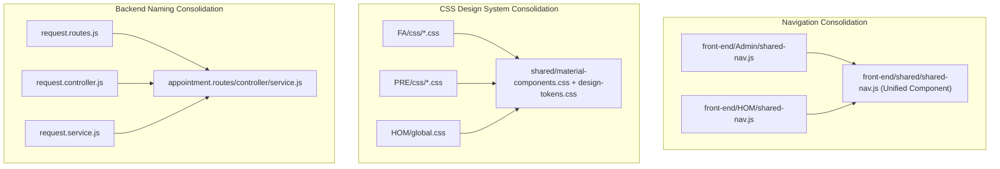

# Codebase Quality Audit & Optimization Report

**Target Codebase**: Federico Healthcare Platform (`back-end` and `front-end`)  
**Audit Scope**: Code Quality, API Calling, State Management, Data Management, Dead/Unused Files, Merging Opportunities, and Architectural Enhancements.  
**Execution Directive**: Analysis only (No source modifications performed).

---

## 1. Code Smells & Antipatterns (Code That Can Be Improved)

### A. Backend Antipatterns

#### 1. Copy-Pasted `FORBIDDEN` Object Across 9 Controllers
- **Locations**:
  - `src/controllers/admission.controller.js` (Line 9)
  - `src/controllers/billing.controller.js` (Line 14)
  - `src/controllers/doctor.controller.js` (Line 9)
  - `src/controllers/inventory.controller.js` (Line 9)
  - `src/controllers/patient.controller.js` (Line 13)
  - `src/controllers/preRequest.controller.js` (Line 8)
  - `src/controllers/rbac.controller.js` (Line 9)
  - `src/controllers/request.controller.js` (Line 9)
  - `src/controllers/ward.controller.js` (Line 12)
- **Issue**: Each file declares `const FORBIDDEN = { message: 'Forbidden resource', error: 'Forbidden', statusCode: 403 };` and manually calls `res.status(403).json(FORBIDDEN);`.
- **Recommendation**: Replace with the centralized domain exception: `throw new ForbiddenError('...')` or `sendError(res, new ForbiddenError('...'), 403)`.

#### 2. Synchronous Disk Writes During Boot in `swagger.js`
- **Location**: `src/config/swagger.js` (Lines 328–335)
- **Issue**: Calls `fs.writeFileSync(path.join(docsPath, 'swagger.json'), ...)` on every application startup. In immutable or read-only container environments (Docker, AWS ECS, Kubernetes), this will crash the process.
- **Outdated OpenAPI Spec**: Documents the legacy `x-role` header scheme (`x-role: { type: 'apiKey' }`) and omits documentation for `/auth/*`, `/pre-requests/*`, and `/marketplace/*`.
- **Recommendation**: Generate `swagger.json` during a build/npm script rather than during live runtime initialization, and update OpenAPI security schemes to `BearerAuth`.

#### 3. Redundant Middleware: `persistOnMutation.js`
- **Location**: `src/middleware/persistOnMutation.js` (Lines 1–15)
- **Issue**: Hooks into `res.on('finish')` to call `persist.save()` on all non-GET requests. Since every DAL repository method (`BaseRepository.create()`, `update()`, `delete()`) already invokes `persist.save()` with debouncing, this middleware creates duplicate debounced timers.
- **Recommendation**: Safely remove `persistOnMutation.js` and its registration in `app.js`.

#### 4. Ambiguous Controller / Service Naming (`request.*` vs `appointment.*`)
- **Location**: `src/controllers/request.controller.js`, `src/services/request.service.js`, `src/routes/request.routes.js`
- **Issue**: The files are named `request.*`, but they operate on `appointments` and are mounted at `/appointment`. Meanwhile, pre-registration requests use `preRequest.*`.
- **Recommendation**: Rename `request.controller.js` -> `appointment.controller.js`, `request.service.js` -> `appointment.service.js`, and `request.routes.js` -> `appointment.routes.js`.

#### 5. `sendResult.js` vs `response.js` Divergence
- **Location**: `src/utils/sendResult.js` and `src/utils/response.js`
- **Issue**: `sendResult.js` is an old adapter from the NestJS migration that returns empty bodies on null, whereas `response.js` provides structured `{ success, statusCode, data/error, meta }` envelopes.
- **Recommendation**: Standardize all controllers on `src/utils/response.js` (`sendSuccess` / `sendError`).

---

### B. Frontend Antipatterns

#### 1. Inconsistent File & Folder Casing in `front-end/PRE/`
- **Locations**:
  - `front-end/PRE/pages/APPointment.html` (Uppercase `APP`)
  - `front-end/PRE/js/Appointment.js` (PascalCase `A`)
  - `front-end/PRE/pages/PRE.html` and `front-end/PRE/js/PRE.js` (ALL CAPS)
  - `front-end/PRE/pages/request.html` vs `front-end/PRE/js/requests.js` (Singular vs Plural)
- **Issue**: Inconsistent naming causes issues on Linux/Docker production servers with case-sensitive filesystems.
- **Recommendation**: Normalize all frontend filenames to lowercase kebab-case (e.g., `appointment.html`, `appointment.js`, `pre-dashboard.html`, `requests.html`).

#### 2. Hardcoded API Base URL in `api-client.js`
- **Location**: `front-end/shared/api-client.js` (Line 8)
- **Issue**: `var API_BASE_URL = "http://localhost:3000";` hardcodes localhost.
- **Recommendation**: Support automatic origin detection with runtime override:
  ```javascript
  var API_BASE_URL = window.__FEDERICO_API_URL__ || 
    (window.location.port === "3000" ? window.location.origin : "http://localhost:3000");
  ```

---

## 2. Unused / Dead Files (Safe for Removal)

| File Path | Current Content / Function | Reason for Removal |
| :--- | :--- | :--- |
| `back-end/src/controllers/app.controller.js` | Returns `'Hello World!'` | Legacy NestJS generator artifact; replace with `/health`. |
| `back-end/src/services/app.service.js` | Returns `'Hello World!'` | Legacy NestJS generator artifact. |
| `front-end/PRE/index.html` | 15-line trampoline redirect to `pages/PRE.html` | Unnecessary redirect; PRE should sit at the standard directory depth. |
| `back-end/docs/express-migration-notes.md` | Migration notes from old sprint | Stale documentation not matching current architecture. |
| `back-end/docs/phase0-audit.md` | Initial code audit notes | Stale documentation. |
| `back-end/docs/phase2-source-of-truth.md` | Intermediate refactoring notes | Stale documentation. |

---

## 3. Consolidation & Merging Opportunities



### 1. Navigation Shell Consolidation (`Admin/shared-nav.js` + `HOM/shared-nav.js`)
- **Opportunity**: Both files share 90% identical code (identical CSS `<style>` tag, identical notification overlays, avatar initials calculation, sign-out handlers).
- **Target**: Create `front-end/shared/shared-nav.js` with a clean configuration object:
  ```javascript
  NavbarComponent.render({
    roleTitle: 'Hospital Operations Manager',
    links: [
      { label: 'Dashboard', href: 'screen-01-dashboard.html' },
      { label: 'Patient Flow', href: 'screen-03-patient-flow.html' },
      ...
    ]
  });
  ```

### 2. CSS Design System Consolidation
- **Opportunity**: Currently, there are 20 separate CSS files. `FA/css/`, `PRE/css/`, and `HOM/global.css` repeat card styling, badge classes, table layouts, and input form styles.
- **Target**: Centralize all reusable component styling into `front-end/shared/material-components.css`. Role-specific folders will only contain page-level grid layouts.

### 3. Directory Flattening for `front-end/PRE/`
- **Opportunity**: `front-end/PRE/` places HTML pages in `PRE/pages/` and scripts in `PRE/js/`, while all other modules (`Admin/`, `HOM/`, `FA/`, `Patient/`) keep HTML at the module root. This causes special-case `../../shared/` paths and `rbac.js` path-prefix hacks.
- **Target**: Move HTML files to `front-end/PRE/*.html` and scripts to `front-end/PRE/js/*.js` to match the exact convention of all other role modules.

### 4. Auth & Onboarding Folder Structure Consolidation
- **Opportunity**: `front-end/signup/`, `front-end/login/`, `front-end/landing/`, and `front-end/marketplace/` are split into 4 separate small folders.
- **Target**: Group public visitor pages into a unified `front-end/public/` or keep auth pages in `front-end/auth/` (`login.html`, `patient-signup.html`, `org-signup.html`).

---

## 4. Summary Matrix of Recommended Refactorings

| Category | Impact | Estimated Complexity | Risk Level |
| :--- | :--- | :--- | :--- |
| **Consolidate Controller FORBIDDEN & Errors** | High (Code consistency & clean error logs) | Low (Mechanical refactor) | Very Low |
| **Remove `persistOnMutation.js` & `app.controller.js`** | Medium (Dead code removal) | Very Low | Very Low |
| **Rename `request.*` to `appointment.*`** | High (Developer clarity & API alignment) | Low | Very Low |
| **Harmonize `PRE` folder structure & file casing** | High (Eliminates path hacks & cross-platform bugs) | Low | Low |
| **Consolidate Shared Navbar (`shared-nav.js`)** | High (DRY UI components) | Medium | Low |
| **Consolidate Fragmented CSS Files** | High (Maintainability & faster loading) | Medium | Low |
| **Update `swagger.js` to dynamic OpenAPI 3.0** | Medium (Accurate API documentation) | Low | Very Low |

---

## 5. API Calling & Network Pipeline Problems

### A. Network Fan-Out & N+1 Waterfall in `patient-store.js`
- **Location**: `front-end/Patient/js/patient-store.js` (Lines 372–388)
- **Problem**: When a patient opens the portal, `refreshStore()` dispatches 7 initial parallel GET requests (`auth.me`, `insuranceForPatient`, `patient.bills`, `patient.receipts`, `doctors.list`, `wards.beds`, `services.list`), followed by `preRequests.list()`, followed by an $N+1$ waterfall:
  ```javascript
  const dischargeSummaries = await Promise.all(
    bundles.map(({ admission }) => 
      window.ApiClient.billing.dischargeSummary.getByAdmission(admission.admission_id)
    )
  );
  ```
  If a patient has 10 visits, this triggers 18 separate HTTP requests on page load.
- **Consequence**: Significant latency, UI lag, and potential server-side rate-limit throttling.
- **Recommended Fix**: Implement a composite endpoint `GET /patient/portal/summary` or have `GET /billing/patient/:id/bills` include discharge summaries inline.

### B. Missing Form Submit Disabling (Double-Submit Race Conditions)
- **Locations**:
  - `front-end/HOM/billing.js` (`submitPostService`)
  - `front-end/FA/js/modules/billing.js` (`addChargeFromForm`, `recordPayment`)
  - `front-end/Patient/js/patient-store.js` (`addAppointment`, `payBill`)
  - `front-end/Admin/departments.js` (`createWard`, `saveBedResize`)
- **Problem**: Async network calls are triggered on button clicks without disabling the submit button or displaying an active loading spinner during the in-flight promise.
- **Consequence**: Users double-clicking buttons trigger duplicate network requests, leading to duplicate appointment bookings, duplicate leader service charges, and duplicate payment transactions.
- **Recommended Fix**: Wrap all form submissions in a reusable utility (`withAsyncLock(buttonEl, asyncFn)`) that disables the button and adds a spinner until resolved.

### C. Missing Request Timeout & Cancellation via `AbortController`
- **Location**: `front-end/shared/api-client.js` (`request`)
- **Problem**: `fetch()` calls are made without an `AbortController` timeout (e.g. 15-second timeout).
- **Consequence**: If the network connection drops mid-request or the backend hangs, UI loaders remain stuck indefinitely with no fallback error or user notification.
- **Recommended Fix**: Add standard 15-second `AbortSignal.timeout(15000)` to all `fetch()` requests in `api-client.js`.

### D. Unhandled Promise Rejections in Global Event Listeners
- **Location**: `front-end/Patient/js/patient-store.js` (Line 553)
- **Problem**:
  ```javascript
  window.addEventListener("federicoSessionChanged", () => {
    if (AppStore.loaded) refreshStore().then(notifyPatientStoreUpdated);
  });
  ```
  `.then()` has no `.catch()` handler. If the network is offline when a session changes, an uncaught promise rejection is logged to the console.
- **Recommended Fix**: Add `.catch((err) => console.warn('[PatientStore] Sync failed:', err))`.

---

## 6. State Management & UI Synchronization Problems

### A. Volatile Global Variable for FA Router State (`window.currentAdmissionId`)
- **Locations**: `front-end/FA/js/router.js` (Line 3) and `front-end/FA/js/app.js` (Line 10)
- **Problem**: The finance module stores the currently selected admission in a global in-memory variable `window.currentAdmissionId`.
- **Consequence**: If a finance associate refreshes the page, clicks the browser back/forward buttons, or bookmarks a link (`#/ledger`), `window.currentAdmissionId` resets to `null`, displaying a broken "no ledger" empty state.
- **Recommended Fix**: Encode route parameters directly into the hash: `#/ledger/:admissionId` or `#/ledger?admissionId=701`.

### B. Total DOM InnerHTML Shredding on State Changes in FA App
- **Location**: `front-end/FA/js/app.js` (Lines 19–34)
- **Problem**: Every time `window.render()` is called, `document.getElementById('app').innerHTML` is wiped and replaced with a `"Loading…"` card before inserting the new HTML.
- **Consequence**: Causes intense visual flickering, loses current scroll position, destroys form input focus, and closes active dropdown menus.
- **Recommended Fix**: Update only the relevant table/view container rather than replacing the entire `#app` root on every interaction.

### C. Redundant Re-Fetching of Entire Database on Dashboard Filter Clicks
- **Location**: `front-end/HOM/dashboard.js` (Lines 52–63)
- **Problem**: In the HOM dashboard, clicking the ward filter button or status filter button executes `renderBedRegistry(dashboardData)`. However, other actions call `renderDashboard()`, which re-fetches 7 entire database collections (`loadDashboardData()`) just to re-render client-side filtered tables.
- **Consequence**: Heavy network overhead on simple UI filter changes.
- **Recommended Fix**: Separate data fetching (`fetchState()`) from UI view rendering (`renderView()`) with client-side caching.

### D. Global Namespace Pollution
- **Locations**:
  - `HOM/beds.js`: `window.setActiveTab`, `window.setActiveFilter`
  - `HOM/billing.js`: `window.openBillingDetail`
  - `FA/js/app.js`: `window.FAActions`, `window.render`
- **Problem**: Arbitrary methods and variables attached directly to the global `window` object create naming collisions and make modular testing impossible.
- **Recommended Fix**: Scope page logic inside self-contained IIFE closures or modules.

---

## 7. Data Management, Referential Integrity & Concurrency Problems

### A. Lack of Relational Foreign Key Validation in Backend Services
- **Problem & Locations**:
  1. **Appointments** (`src/services/request.service.js`): `create()` accepts `patient_id` and `doctor_id` without verifying if the patient or doctor exists in `PatientRepository` or `DoctorRepository`.
  2. **Billing Leaders** (`src/services/billing.service.js`): `createLeader()` creates service records even if `admission_id` or `service_id` are invalid.
  3. **Doctor Availabilities** (`src/services/doctor.service.js`): `createAvailability()` creates slots without verifying if `doctor_id` exists.
- **Consequence**: Corrupted records with orphaned foreign keys that crash frontend joins and table renderings.
- **Recommended Fix**: Enforce relational existence checks in service creation methods, throwing `NotFoundError` or `ValidationError` if referenced IDs do not exist.

### B. Missing Cascading Deletion / Foreign Key Protection
- **Problem & Locations**:
  1. **Doctor Deletion** (`src/services/doctor.service.js#deleteDoctor`): Deleting a doctor does not cancel, reassign, or check active appointments referencing that doctor.
  2. **Ward Deletion** (`src/services/ward.service.js#deleteWard`): Deleting a ward deletes its beds, leaving past patient admissions referencing non-existent `bed_id`s.
  3. **Inventory Deletion** (`src/services/inventory.service.js#deleteItem`): Deleting an item leaves pending purchase requests and ledger entries pointing to a deleted `item_id`.
- **Consequence**: Broken historical records and dangling pointers across the system.
- **Recommended Fix**: Implement soft-deletion (`is_active: false` / `deleted_at: string`) for doctors, wards, and inventory items instead of hard physical deletion.

### C. Lack of Transaction Isolation in Multi-Step Mutations
- **Location**: `src/controllers/ward.controller.js#updateBedRequest` (Lines 131–165)
- **Problem**: Bed allocation executes 4 separate state mutations:
  1. `wardService.updateBedRequest` (Bed $\rightarrow$ `OCCUPIED`, BedRequest $\rightarrow$ `ALLOCATED`)
  2. `preRequestService.transition` (PreRequest $\rightarrow$ `ADMITTED`)
  3. `admissionService.create` (Creates Admission)
  4. `billingService.createLedger` (Creates Open Ledger)
- **Consequence**: If step 3 or 4 fails (e.g. invalid schema or server crash), steps 1 and 2 are already committed to disk. This leaves a "phantom occupied bed" that has no admission and no billing ledger.
- **Recommended Fix**: Wrap multi-step mutations in a transactional unit-of-work with compensational rollback on failure.

### D. Unbounded In-Memory Array Scans ($O(N)$) & Missing Pagination
- **Locations**: All repository `findAll()` methods and controller listing endpoints (`/patient`, `/doctor`, `/ward`, `/billing/ledgers`, `/activity-log`, `/pre-requests`).
- **Problem**: Every query performs an unindexed linear scan (`Array.prototype.filter()`) across the entire collection and returns the full unbounded array.
- **Consequence**: When the system reaches 10,000 patients or 50,000 activity logs, a single GET request will serialize tens of megabytes of JSON, blocking Node's event loop and crashing browser tabs.
- **Recommended Fix**: Introduce standard query parameters: `limit` (default: 50, max: 100), `offset` / `page`, and return pagination metadata (`{ items, total, page, pageSize }`).

### E. Date & Time String Timezone Inconsistencies
- **Problem**: Timestamp formatting is mixed across three styles:
  - ISO 8601 strings: `2026-08-23T17:00:00.000Z`
  - SQL-style strings: `2026-03-01 10:00:00`
  - Local 12-hour strings: `10:00 AM`
  - In `patient-store.js` line 147: `formatShortDate(date + "T00:00:00")` parses without timezone offsets, leading to day-shift bugs depending on the client's local timezone.
- **Recommended Fix**: Enforce UTC ISO 8601 strings for all backend timestamp storage and use timezone-safe formatters in `front-end/shared/formatters.js`.

---

## 8. Consolidated Priority Remediation Matrix

| Category | Finding / Issue | Severity | Proposed Fix |
| :--- | :--- | :--- | :--- |
| **Data Integrity** | Foreign keys not validated on appointment/leader creation | 🔴 High | Add relational existence checks in services |
| **Data Integrity** | Hard deletion of doctors/wards creates orphaned records | 🔴 High | Implement soft-deletion (`is_active: false`) |
| **API Calling** | Patient portal $N+1$ network request waterfall | 🔴 High | Create composite `GET /patient/portal/summary` endpoint |
| **API Calling** | Missing button disable on async form submits | 🔴 High | Add async button locking to prevent double-submits |
| **State Management** | Volatile `window.currentAdmissionId` in FA router | 🟡 Medium | Encode admission ID directly in URL hash |
| **State Management** | Full DOM innerHTML wipe on FA render | 🟡 Medium | Scoped container updates instead of root `#app` wipe |
| **Performance** | Unbounded $O(N)$ scans & missing pagination on listings | 🟡 Medium | Add `limit` and `page` query params to `findAll()` |
| **Reliability** | Missing `fetch()` timeout in `api-client.js` | 🟡 Medium | Add 15s `AbortSignal.timeout(15000)` |
| **Architecture** | Synchronous disk writes on server boot in `swagger.js` | 🟡 Medium | Generate swagger docs during build/npm script |
| **Architecture** | Redundant `persistOnMutation.js` middleware | 🟢 Low | Remove middleware; rely on DAL repository saves |
| **Architecture** | Duplicate navbar code in `Admin` & `HOM` | 🟢 Low | Consolidate into `shared/shared-nav.js` |
| **Architecture** | Inconsistent casing in `front-end/PRE/` | 🟢 Low | Normalize all filenames to lowercase kebab-case |
