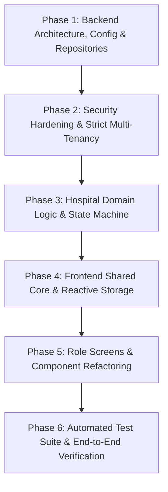
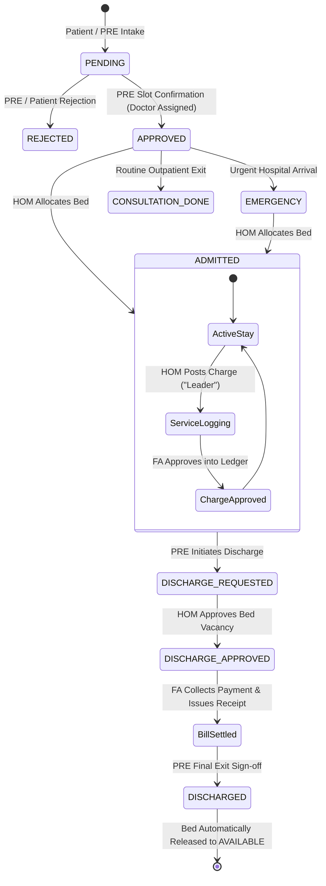

# Production-Grade Architecture & Implementation Plan: Federico Hospital Operations Platform

A comprehensive technical blueprint to refactor, restructure, and elevate the Federico platform into an enterprise-grade, maintainable, secure, and production-ready system following top-tier industry standards.

---

## 1. Executive Roadmap: 6 Execution Phases



---

## 2. Target Production Engineering Standards

### 2.1 Backend Layered Architecture (Clean Architecture & Repository Pattern)

```
back-end/src/
├── config/              # Centralized environment configuration (12-Factor App)
│   ├── env.js           # Validated environment variables (PORT, JWT_SECRET, CORS, DB_PATH)
│   └── constants.js     # System-wide enums and static catalogs
├── errors/              # Domain Exception Hierarchy
│   ├── AppError.js      # Base operational error class
│   ├── NotFoundError.js
│   ├── UnauthorizedError.js
│   ├── ForbiddenError.js
│   ├── ValidationError.js
│   └── ConflictError.js
├── middleware/          # HTTP & Transport Pipeline
│   ├── auth.middleware.js       # Bearer token verification & session attachment
│   ├── tenant.middleware.js     # Strict tenant resolution & feature-flag enforcement
│   ├── rbac.middleware.js       # Role & custom dynamic permission verification
│   ├── validate.middleware.js   # Type-safe DTO validation engine
│   ├── error.middleware.js      # Centralized error handler & response serializer
│   └── logger.middleware.js     # Structured HTTP request logger
├── repositories/        # Data Access Layer (DAL) - Repository Pattern
│   ├── BaseRepository.js        # Abstract CRUD, atomic ID sequence, tenant filter
│   ├── PatientRepository.js
│   ├── DoctorRepository.js
│   ├── WardRepository.js
│   ├── BedRepository.js
│   ├── AppointmentRepository.js
│   ├── PreRequestRepository.js
│   ├── AdmissionRepository.js
│   ├── BillingRepository.js
│   ├── InventoryRepository.js
│   ├── OrganizationRepository.js
│   └── RbacRepository.js
├── services/            # Pure Business Logic Layer (HTTP-agnostic)
│   ├── auth.service.js
│   ├── patient.service.js
│   ├── doctor.service.js
│   ├── ward.service.js
│   ├── appointment.service.js
│   ├── admission.service.js
│   ├── preRequest.service.js   # Core hospital intake state machine
│   ├── billing.service.js      # Inpatient ledger & leader approval workflow
│   ├── inventory.service.js
│   ├── rbac.service.js
│   ├── organization.service.js
│   └── platform.service.js
├── controllers/         # Presentation Layer (Thin HTTP handlers)
│   ├── auth.controller.js
│   ├── patient.controller.js
│   ├── doctor.controller.js
│   ├── ward.controller.js
│   ├── appointment.controller.js
│   ├── admission.controller.js
│   ├── preRequest.controller.js
│   ├── billing.controller.js
│   ├── inventory.controller.js
│   ├── rbac.controller.js
│   ├── organization.controller.js
│   └── platform.controller.js
├── routes/              # Route Definitions & Middleware Wiring
│   ├── index.js         # Master API router
│   ├── auth.routes.js
│   ├── patient.routes.js
│   ├── doctor.routes.js
│   ├── ward.routes.js
│   ├── appointment.routes.js
│   ├── admission.routes.js
│   ├── preRequest.routes.js
│   ├── billing.routes.js
│   ├── inventory.routes.js
│   ├── rbac.routes.js
│   ├── marketplace.routes.js
│   └── platform.routes.js
├── store/               # In-Memory Storage & Durability Engine
│   ├── dataStore.js     # In-memory collections
│   └── persist.js       # Atomic crash-safe file persistence (.tmp swap)
└── utils/               # Shared Pure Utilities
    ├── password.js      # Async bcrypt promises
    ├── response.js      # Standardized JSON response envelope
    └── token.js         # Cryptographic token generator
```

---

### 2.2 Standardized REST API Response Contract

#### Success Envelope (HTTP 200 / 201)
```json
{
  "success": true,
  "statusCode": 200,
  "data": { ... },
  "meta": {
    "timestamp": "2026-08-23T22:30:00.000Z",
    "total": 42
  }
}
```

#### Error Envelope (HTTP 400 / 401 / 403 / 404 / 409 / 500)
```json
{
  "success": false,
  "statusCode": 400,
  "error": {
    "code": "VALIDATION_ERROR",
    "message": "Validation failed on 2 fields",
    "details": [
      "phone must be a valid phone number",
      "dob must be a valid ISO 8601 date string"
    ]
  },
  "meta": {
    "timestamp": "2026-08-23T22:30:00.000Z"
  }
}
```

---

### 2.3 Security & Resilience Best Practices

1. **Strict Fail-Closed Multi-Tenancy**:
   - `tenant.middleware.js` extracts `organizationId` from authenticated session. If unauthenticated or invalid, access to tenant-scoped resources is denied (no fallback to default Org 1).
   - `BaseRepository` automatically applies `record.organization_id === tenant.organizationId` across all queries, preventing cross-tenant data leakage.
2. **No Backdoors or Insecure Overrides**:
   - Deprecate insecure `x-role` header bypasses; all operations require cryptographic session tokens.
   - Remove unauthenticated `/data/full-state` bulk override routes.
3. **Async Non-Blocking Cryptography**:
   - Replace all `bcrypt.hashSync` / `compareSync` with async `bcrypt.hash` / `bcrypt.compare` to preserve Node.js event-loop throughput under concurrent load.
4. **Crash-Safe Atomic File Persistence**:
   - `persist.js` writes to a temporary file (`db.json.tmp`) and executes atomic `fs.promises.rename` to prevent database corruption during sudden server crashes or reboots.
5. **Atomic ID Generation**:
   - Repositories utilize dedicated atomic sequence counters (`idCounters[collection]++`) instead of `Math.max(...map()) + 1`, eliminating race conditions during high concurrency.

---

### 2.4 Harmonized Healthcare Workflow State Machine



---

## 3. Detailed Phase Breakdown

### **Phase 1: Backend Core Infrastructure & Repository Layer (DAL)**
- Create `src/config/env.js` (loading from `.env` with validated defaults).
- Create `src/errors/` with `AppError`, `NotFoundError`, `UnauthorizedError`, `ForbiddenError`, `ValidationError`, `ConflictError`.
- Create `src/utils/response.js` for standardized `{ success, statusCode, data/error, meta }` envelopes.
- Create `src/repositories/BaseRepository.js` and entity repositories (`PatientRepository`, `BedRepository`, `LedgerRepository`, `PreRequestRepository`, etc.) with atomic sequence ID generators.
- Refactor `src/store/persist.js` with atomic file writes (`db.json.tmp` $\rightarrow$ atomic rename).
- Refactor `src/utils/password.js` to async `bcrypt.hash` and `bcrypt.compare`.

### **Phase 2: Security Hardening & Strict Multi-Tenancy Pipeline**
- Refactor `src/middleware/session.js` to strictly verify bearer tokens.
- Refactor `src/middleware/tenant.js` to extract `organizationId` from authenticated sessions only.
- Refactor `src/middleware/actorAccess.js` to remove `x-role` bypasses and enforce session roles and dynamic RBAC grants.
- Remove unauthenticated `/data/full-state` bulk override routes from `src/routes/data.routes.js`.
- Refactor `src/middleware/errorHandler.js` to catch domain errors and serialize them into standard JSON error envelopes.

### **Phase 3: Domain Services & Hospital Lifecycle Harmonization**
- Refactor `src/services/preRequest.service.js` with strict actor transition matrix.
- Bed allocation in `src/services/ward.service.js` automatically marks bed `OCCUPIED`, initializes `admission` record, and creates `OPEN` billing ledger.
- Refactor `src/services/billing.service.js`: HOM service usage postings ("Leaders") require FA review and approval before becoming official line items in `ledgerEntries`.
- PRE final discharge slip marks admission `DISCHARGED` and automatically flips physical bed status back to `AVAILABLE`.
- Connect emergency intake to automatic temporary patient registration and bed assignment.

### **Phase 4: Frontend Shared Core & Reactive Storage Architecture**
- Fix `front-end/shared/api-client.js` to store sessions in `localStorage` with reactive `window.addEventListener('storage')` for instant cross-tab sync.
- Wrap all API requests with interceptors, automatic bearer token attachment, and standardized error parsing.
- Refactor `front-end/shared/rbac.js` to dynamically apply hospital organization logo, name, and feature-flagged nav elements.
- Refactor `front-end/shared/ui-feedback.js` with non-blocking accessible modal dialogs, confirmations, and toast snackbars.

### **Phase 5: Frontend Role Screens & Component Refactoring**
- **Admin Module (`front-end/Admin/`)**: Refactor `admin.js`, `dashboard.js`, `departments.js`, `inventory-catalog.js`.
- **HOM Module (`front-end/HOM/`)**: Refactor `beds.js`, `patient-flow.js`, `inventory.js`, `billing.js`, `dashboard.js`.
- **FA Module (`front-end/FA/`)**: Refactor `app.js` and `modules/billing.js` for hash routing, ledger review, recent charge approvals, cash payment collection, and discharge summary generation.
- **PRE Module (`front-end/PRE/`)**: Refactor `Appointment.js`, `requests.js`, `discharge.js`, `admitted.js`, `emergency.js`.
- **Patient Portal (`front-end/Patient/`)**: Refactor `patient-dashboard.js`, `patient-book-appointment.js`, `patient-billing.js`, `patient-profile.js`.
- **Auth & Marketplace**: Polish `login-page.js`, `signup-page.js`, `org-signup.js`, `marketplace-page.js`, and `platform-dashboard.js`.

### **Phase 6: Automated Test Suite & End-to-End Verification**
- Install backend dependencies (`npm install`).
- Run automated Jest test suites (`npm test`) across all services and repositories.
- Execute API endpoint integration test scripts.
- Run multi-actor end-to-end workflow validation.
- Generate comprehensive `walkthrough.md` summarizing changes and test results.
