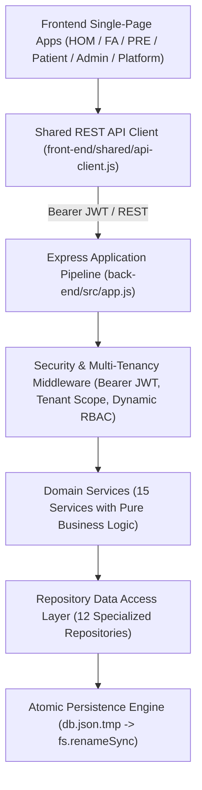
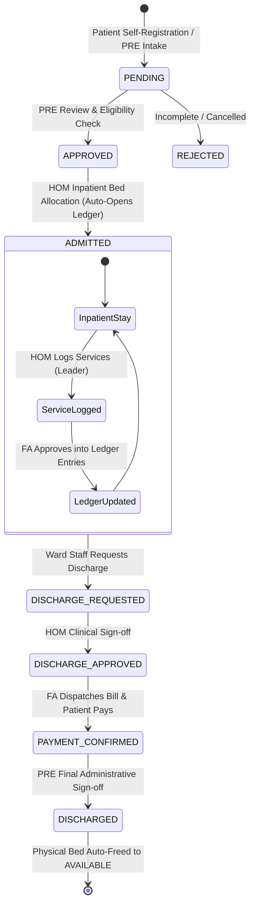

# 🏥 Federico — Multi-Tenant Hospital Administrative Operations Platform

[](https://nodejs.org/)
[](https://expressjs.com/)
[](https://jestjs.io/)
[](https://github.com/IIIT-Sricity-FSD-2024-2028/16_Federico)
[](http://localhost:3000/api)

**Federico** is an enterprise-grade, Multi-Tenant SaaS Hospital Management System (HMS) built to streamline non-clinical administrative workflows: patient intake, real-time bed management, department & inventory cataloging, dynamic role-based access control (RBAC), and transparent billing ledgers.

> ⚠️ **Scope Notice**: Federico is a **non-clinical administrative system**. It manages administrative operations, beds, and billing; it does not perform clinical diagnosis, medical prescriptions, or clinical decision support.

---

## 🏛️ System Architecture

Federico is built following **Clean Layered Architecture** with strict multi-tenant isolation, fail-closed access controls, and ACID crash-safe atomic disk persistence:



---

## 👥 6-Tier Role Personas & Portals

| Role | Portal Path | Responsibilities |
| :--- | :--- | :--- |
| **👑 Platform Super User** | `front-end/platform/` | Multi-tenant SaaS management: provisions organizations, manages subscription plans, toggles module flags (`PHARMACY`, `LAB`, `INSURANCE`, `EMERGENCY`), and inspects audit logs. |
| **🏢 Hospital Admin** | `front-end/Admin/` | Organization owner: manages hospital branches, department catalogs, inventory items, custom RBAC roles, and staff permissions. |
| **🏥 Hospital Operations Manager (HOM)** | `front-end/HOM/` | Operational resource management: real-time bed registry, bed allocations, clinical service usage logging (Leader charges), and medical discharge approval. |
| **📋 Patient Registration & Eligibility (PRE)** | `front-end/PRE/` | Front-desk patient intake: reviews pre-registrations, schedules OPD appointments, handles emergency admissions, and grants final administrative discharge. |
| **💰 Finance Associate (FA)** | `front-end/FA/` | Financial administration: reviews HOM Leader charges, approves ledger entries, computes insurance copays, dispatches digital bills, and records payments. |
| **🧑 Patient** | `front-end/Patient/` | Self-service portal: books appointments, uploads insurance policies, tracks inpatient stay, reviews itemized bills, and makes online payments. |

---

## 🔄 Patient Lifecycle State Machine



---

## 🚀 Quick Start Guide

### Prerequisites
- [Node.js](https://nodejs.org/) (v18.x or higher)
- [npm](https://www.npmjs.com/) (v9.x or higher)

### 1. Install Dependencies
```bash
cd back-end
npm install
```

### 2. Start the Backend Server
```bash
# Production mode
npm start

# Development mode (auto-restart with nodemon)
npm run start:dev
```
The backend will launch on `http://localhost:3000`.

- **Health Check**: `http://localhost:3000/health`
- **Interactive OpenAPI Documentation**: `http://localhost:3000/api`

### 3. Launch the Frontend
You can serve the `front-end/` folder using any static HTTP server or open directly in your browser:
```bash
# Example using npx serve or Live Server
npx serve front-end -p 5500
```
Visit `http://localhost:5500/landing/landing-page.html` or `http://localhost:5500/login/login-page.html`.

---

## 🔑 Demo Login Credentials

| Role | Email | Password | Scope |
| :--- | :--- | :--- | :--- |
| **Platform Super User** | `platform@federico.com` | `Platform@123` | Global Platform Admin |
| **Hospital Admin** | `owner@hosp.com` | `Owner@123` | City Hospital Admin |
| **Hospital Operations (HOM)** | `admin@hosp.com` | `Hom@123` | Ward & Bed Operations |
| **Patient Registration (PRE)** | `rekha.pre@hosp.com` | `Pre@123` | Patient Intake & Scheduling |
| **Finance Associate (FA)** | `farah.fa@hosp.com` | `Fa@123` | Billing & Ledgers |
| **Patient** | `hamiz@hosp.com` | `Hamiz@123` | Patient Portal |

---

## 🧪 Automated Testing

Federico features a comprehensive automated test suite covering unit tests, integration tests, security middleware, and the full multi-role patient lifecycle:

```bash
cd back-end
npm test
```

### Test Suite Results:
```
Test Suites: 17 passed, 17 total
Tests:       90 passed, 90 total
Snapshots:   0 total
Time:        2.424 s
Ran all test suites.
```

---

## 📁 Repository Structure

```
16_Federico/
├── definitions.yml              # Complete YAML domain and endpoint definitions
├── front-end/                   # Frontend role applications & shared design system
│   ├── Admin/                   # Hospital Admin portal (branches, roles, catalogs)
│   ├── FA/                      # Finance Associate billing portal
│   ├── HOM/                     # Hospital Operations Manager portal
│   ├── PRE/                     # Patient Registration & Eligibility portal
│   ├── Patient/                 # Patient self-service portal
│   ├── platform/                # Platform Super User SaaS management
│   ├── login/ & signup/         # Multi-tenant authentication & onboarding
│   ├── marketplace/             # Hospital self-service marketplace
│   └── shared/                  # Shared REST API client, design tokens & UI components
└── back-end/                    # Express REST API backend
    ├── src/
    │   ├── config/              # 12-factor environment & Swagger configuration
    │   ├── controllers/         # HTTP controllers with standardized JSON envelopes
    │   ├── errors/              # Typed domain exception hierarchy (AppError)
    │   ├── middleware/          # Session auth, fail-closed tenancy, and dynamic RBAC
    │   ├── repositories/        # Data Access Layer (12 specialized DAL repositories)
    │   ├── routes/              # Declarative REST endpoint routers
    │   ├── services/            # Pure domain services & state machine orchestrators
    │   ├── store/               # In-memory database & crash-safe atomic disk persistence
    │   ├── utils/               # Response envelopes, password hashing, and formatters
    │   ├── validators/          # Declarative input validation engine
    │   └── test/                # Automated test suites (E2E, data integrity, frontend)
    ├── data/                    # JSON persistence snapshot (db.json)
    └── package.json             # Backend dependencies and scripts
```

---

## 📄 License
This project is licensed under the MIT License - see the [LICENSE](LICENSE) file for details.
