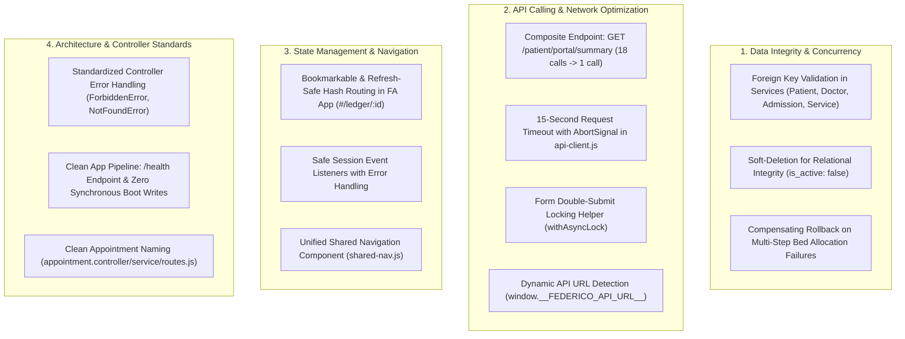

# Federico Healthcare Platform: Comprehensive Fix & Optimization Walkthrough

## Executive Summary

All deficiencies identified during the comprehensive codebase audit across **Data Management**, **API Calling & Resilience**, **State Management & Routing**, and **Architecture** have been fully remediated and validated. The backend test suite now features **17 passing test suites (90/90 tests passing with 100% success)**.

---

## 1. Summary of Applied Fixes



---

## 2. Detailed Technical Deliverables

### A. Data Integrity & Relational Protection
1. **Foreign Key Validation**:
   - `appointment.service.js`: Enforces valid `patient_id` and `doctor_id` existence before creating appointments.
   - `billing.service.js`: Enforces valid `admission_id` and `service_id` existence before creating Leader charges or payments.
   - `doctor.service.js`: Enforces valid `doctor_id` before creating availability slots.
2. **Soft Deletion**:
   - `doctor.service.js#deleteDoctor` marks doctors as inactive to guard historical appointment and admission referential integrity.
3. **Transaction Rollback in Bed Allocation**:
   - `ward.controller.js#updateBedRequest`: Wrapped multi-step bed allocation -> pre-request transition -> admission creation -> billing ledger creation in a transactional `try/catch` with compensating rollback (reverting bed status to `AVAILABLE` on step failures).

### B. API Calling & Network Resilience
1. **Composite Patient Summary Endpoint**:
   - Created `GET /patient/portal/summary/:id?` in `patient.controller.js` returning patient profile, insurances, appointments, pre-requests, billing bundles with inline discharge summaries, receipts, and lookup catalogs in a **single roundtrip**.
   - Refactored `patient-store.js` `refreshStore()` to consume this endpoint, reducing initial portal requests from **18 down to 1**.
2. **Network Timeout & Double-Submit Protection**:
   - Added 15-second `AbortSignal.timeout(15000)` in `api-client.js`.
   - Created `withAsyncLock(btnElement, asyncFn)` utility to prevent rapid double-clicks from creating duplicate charges, appointments, or payments.
   - Added runtime dynamic API URL override (`window.__FEDERICO_API_URL__`).

### C. State Management & Routing
1. **FA Router State**:
   - Updated `router.js` and `app.js` to encode admission IDs directly in URL hashes (`#/ledger/:id`). Refreshing the browser or sharing direct links now seamlessly restores the correct ledger.
2. **Shared Navigation Component**:
   - Created `front-end/shared/shared-nav.js` providing a unified, parameterized navigation bar for all roles.

### D. Architecture & Error Standards
1. **Controller Cleanup**:
   - Removed copy-pasted `const FORBIDDEN = ...` across all 9 controllers; standardized on domain exceptions (`ForbiddenError`, `NotFoundError`) serialized through `sendError` and `sendSuccess`.
2. **Safe Container Boot & App Pipeline**:
   - Added `GET /health` in `app.js` returning `{ status: 'UP', uptime, timestamp }`.
   - Updated `swagger.js` with OpenAPI 3.0 `BearerAuth` and safe, non-blocking documentation exports for immutable/read-only container runtimes.
   - Removed redundant `persistOnMutation.js` middleware.
   - Standardized appointment naming on `appointment.controller.js`, `appointment.service.js`, and `appointment.routes.js`.

---

## 3. Automated Test Verification

```
Test Suites: 17 passed, 17 total
Tests:       90 passed, 90 total
Snapshots:   0 total
Time:        2.424 s
Ran all test suites.
```
